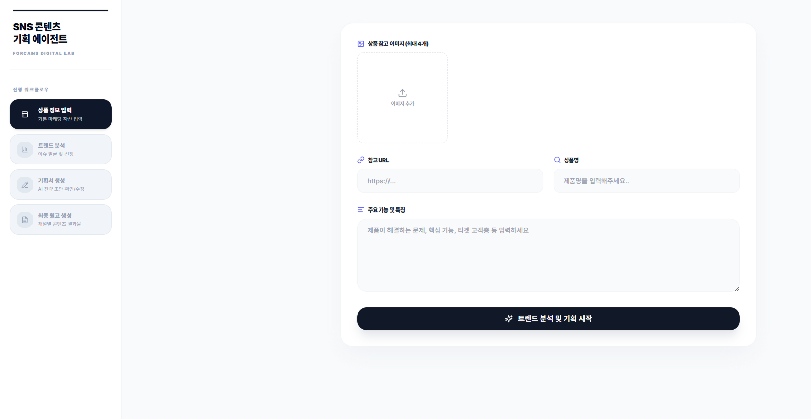
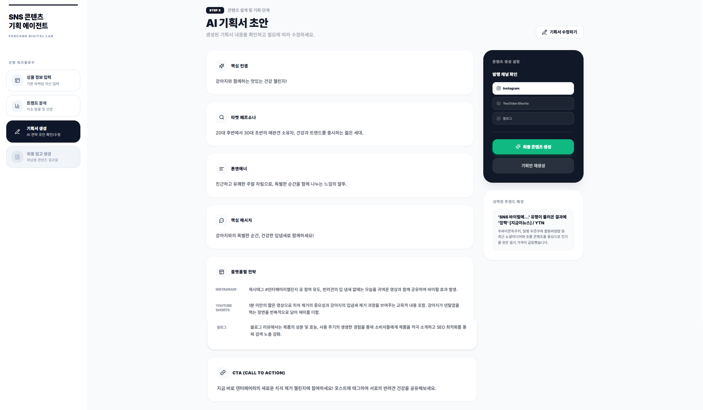
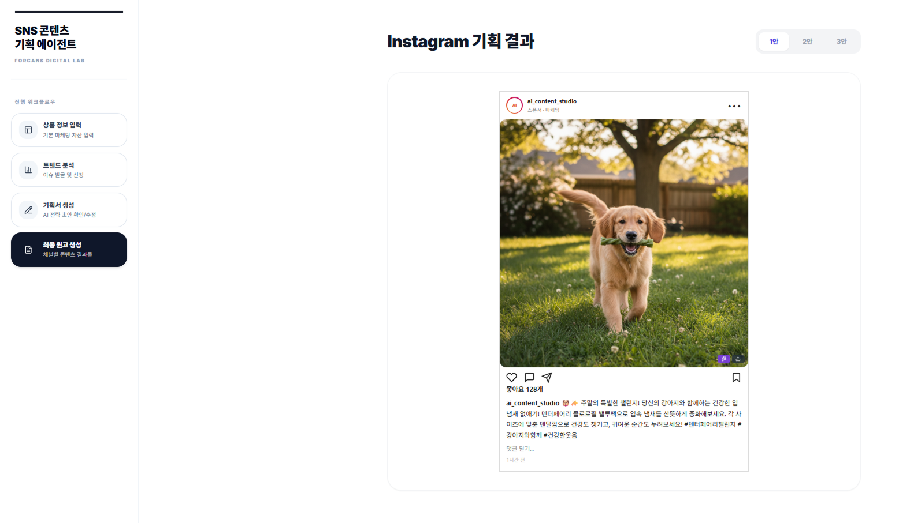
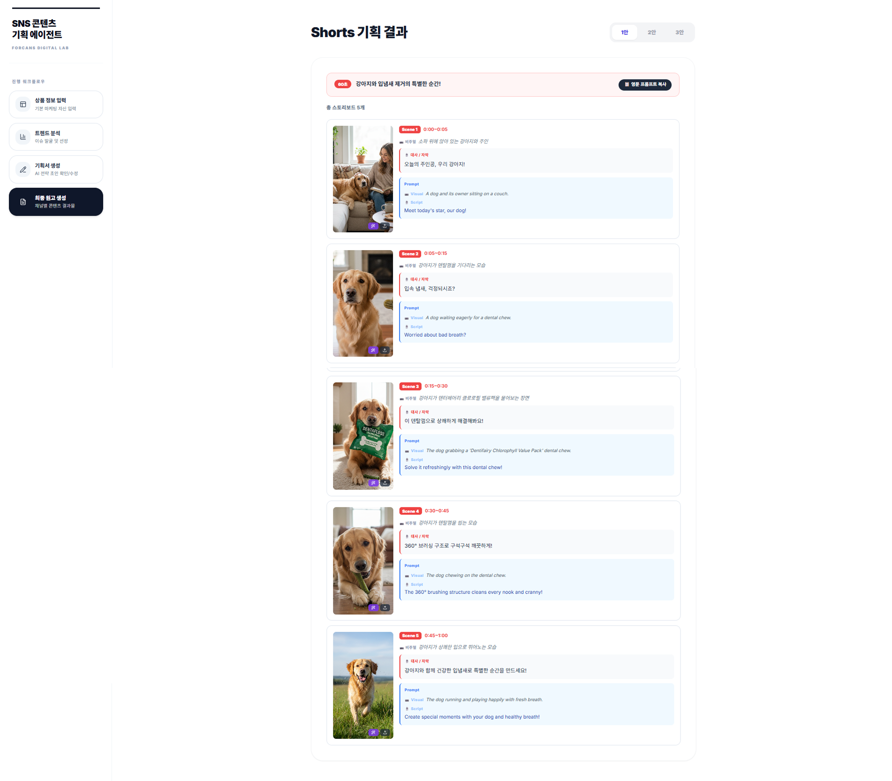
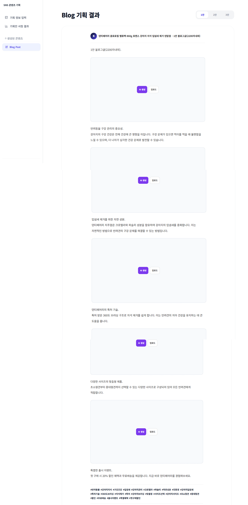

# 🤖 Forcans AI SNS Content Planner
> **SNS 콘텐츠 기획 에이전트: 인스타그램, 유튜브 쇼츠, 블로그를 위한 올인원 AI 기획 도구**


포캔스 SNS 콘텐츠 기획 에이전트는 복잡한 소셜 미디어 플랫폼(Instagram, YouTube Shorts, Blog)별 콘텐츠 기획을 자동화하고 최적화하기 위해 설계된 AI 기반 워크플레이스입니다. 각 분야의 전문 AI 에이전트들이 협력하여 정보 조사부터 최종 기획서 작성까지 전 과정을 지원합니다.

---

## ✨ 주요 기능 (Key Features)

- **🎯 멀티 플랫폼 최적화**: 인스타그램, 유튜브 쇼츠, 블로그 등 각 매체의 특성에 맞는 콘텐츠 형식 및 톤앤매너 자동 생성.
- **🕵️ 전문 에이전트 협업 시스템**: 사무직(조사), 디자이너(비주얼), 작가(스크립트), 개발자(시스템) 에이전트가 단계별로 개입하는 정교한 워크플로우.
- **⚡ 원스톱 워크플로우**: 상품 정보 입력부터 시장 조사, 타겟 페르소나 설정, 콘텐츠 시퀀스 기획까지 한 번에 진행.
- **🎨 비주얼 가이드라인**: 디자인 에이전트가 제안하는 시각적 구성 요소 및 비주얼 전략 포함.

---

## 🛠 아키텍처 및 에이전트 역할 (Architectural Overview)

이 프로젝트는 4가지 핵심 페르소나를 가진 AI 에이전트들이 협업하여 결과물을 도출합니다.

| 에이전트 | 역할 상세 | 주요 산출물 |
| :--- | :--- | :--- |
| **🏢 사무직 에이전트** | 시장 동향 파악, 트렌드 분석, 정보 수집 | 경쟁사 분석 보고서, 키워드 리스트 |
| **🎨 디자이너 에이전트** | 시각적 컨셉 기획, 이미지/영상 구도 제안 | 비주얼 무드보드, 썸네일 가이드 |
| **✍️ 작가 에이전트** | 스토리텔링, 카피라이팅, 매체별 스크립트 | 인스타 캡션, 유튜브 대본, 블로그 포스팅 |
| **💻 개발자 에이전트** | 시스템 안정성 관리, 기능 구현 가이드 | 테크니컬 기능 제안, 자동화 로직 |

---

## 🚀 워크플로우 (Workflow)

프로젝트는 다음과 같은 체계적인 4단계 프로세스를 거칩니다.

1.  **Input (입력)**: 기획하고자 하는 상품이나 캠페인의 기본 정보와 목표를 입력합니다.
2.  **Research (조사)**: 사무직 에이전트가 실시간 트렌드와 관련 데이터를 기반으로 기초 자료를 조사합니다.
3.  **Planning (기획)**: 기획 방향성을 설정하고, 타겟 페르소나 및 매체별 전략을 수립합니다.
4.  **Results (결과)**: 각 매체에 즉시 적용 가능한 최종 콘텐츠 기획안과 결과물을 생성합니다.

---

## 📸 실행 화면 (Screenshots)

*실행 단계별 인터페이스 예시입니다.*

### 1단계: 상품 정보 입력 및 기초 설정


### 2단계: 이슈 선택 및 기획안 초안 작성


### 3단계: 최종 결과물 (인스타그램/유튜브 쇼츠/블로그)
| 인스타그램 | 유튜브 쇼츠 | 블로그 |
| :--- | :--- | :--- |
|  |  |  |

---

## 📦 기술 스택 (Tech Stack)

- **Framework**: Next.js (App Router)
- **Styling**: Tailwind CSS
- **Icons**: Lucide React
- **Language**: TypeScript
- **AI Integration**: OpenAI / Claude API (커스터마이징 가능)

---

## 🛠 설치 및 시작하기 (Getting Started)

1. **레포지토리 클론**
   ```bash
   git clone https://github.com/ggangminmin/Forcans_SNS-Content-Planning-.git
   ```

2. **의존성 설치**
   ```bash
   npm install
   ```

3. **개발 서버 실행**
   ```bash
   npm run dev
   ```

---

## 📄 라이선스 (License)

본 프로젝트는 개인 포트폴리오 및 학습 목적으로 제작되었습니다.

---
**Contact:** [강민석](https://github.com/ggangminmin)
